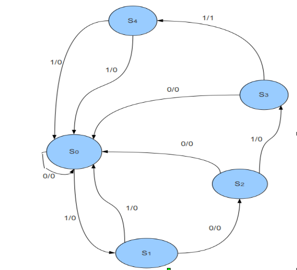
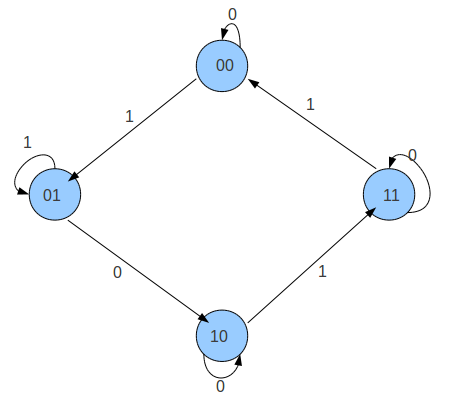

1.  A student was asked to design a state diagram for a circuit to detect the sequence 1011 in a given input stream. The student came up with the following design:

a. What will be the sequence of states and outputs for the following input sequence: 10101101011000?

b. Does the circuit correctly solve the problem? Why or why not? If not, what changes should be made to the state diagram?

2. Design a clocked sequential circuit for the following state diagram:

Use JK flip-flops and combinational logic in the design. Import the flip-flops as black boxes. The circuit has an input x.

(HINT: Create excitation tables for J and K inputs of the flip-flops. The present state and input x will be fed to combinational logic, which will generate the J and K inputs for each flip-flop.)

3. Design a Moore state machine that detects the sequence "101" in a continuous input stream. The machine should output '1' when the sequence is detected and '0' otherwise. Draw the complete state diagram with proper state labeling.

4. Compare the differences between Mealy and Moore state machines. Design both Mealy and Moore versions for a sequence detector that outputs '1' when it detects "110" in the input stream. Explain the key differences in your implementations.
