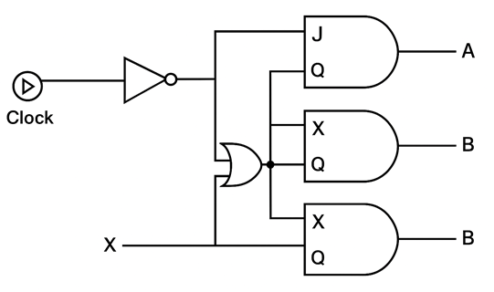
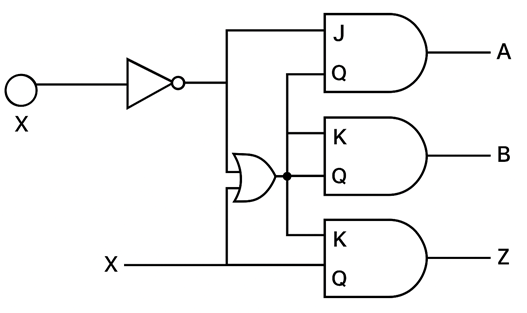

### State Diagram Implementation

#### Circuit Diagram

_Figure 1: Complete state diagram circuit implementation using JK flip-flops and combinational logic gates. Reference: Theory section_

#### Components Required

- 2 JK flip-flops
- 1 NOT gate
- 1 AND gate
- 1 XOR gate
- 1 Clock signal

#### Circuit Connections

1. **Clock Connection Setup**:

   - Locate the Clock signal in the component library and drag it to the working area.
   - Connect the Clock signal to the Clock (CLK) inputs of both JK flip-flops. This is essential for synchronous operation of the sequential circuit.

2. **Flip-Flop Placement**:

   - Drag the first JK flip-flop and place it near output bit A.
   - Drag the second JK flip-flop and place it near output bit B.

3. **Logic Gate Placement**:

   - Drag a NOT gate and place it near the X input bit.
   - Drag an AND gate and place it in the central working area.
   - Drag an XOR gate and place it in the central working area.

4. **Input Connections**:

   - Connect the X input to the input of the NOT gate.
   - Connect the X input to one input of the XOR gate.

5. **Flip-Flop Input Connections**:

   - Connect the output of the NOT gate to the J input of the lower flip-flop.
   - Connect the output of the NOT gate to one input of the AND gate.
   - Connect the Q output of the upper flip-flop to the other input of the XOR gate.
   - Connect the Q output of the lower flip-flop to the other input of the AND gate.
   - Connect the Q output of the lower flip-flop to the J input of the upper flip-flop.

6. **Flip-Flop Output Logic Connections**:

   - Connect the output of the AND gate to the K input of the upper flip-flop.
   - Connect the output of the XOR gate to the K input of the lower flip-flop.

7. **Final Output Connections**:

   - Connect the Q output of the upper flip-flop to output bit A.
   - Connect the Q output of the lower flip-flop to output bit B.

8. **Input Stream Configuration**:

   - Click on "Input" to add a binary input stream for X.
   - Enter the desired bit sequence for testing the state machine behavior.

9. **Simulation Execution**:
   - Click on "Simulate" to run the circuit (default start state will be A=0 and B=0).
   - Observe the state transitions as the input bits are processed.

#### Observations

- The circuit implements a finite state machine that responds to the input stream X.
- Depending upon the input stream given, the states of A and B will change from one state to another or remain the same.
- For instance, if the first input bit in the stream is 1, the output bits will transition according to the state diagram logic.
- The Clock signal ensures that all state transitions occur synchronously on clock edges, maintaining proper timing relationships.
- The combination of JK flip-flops and combinational logic implements the next state logic and output logic of the finite state machine.
- If the circuit has been constructed correctly as described above, a "Success" message will be displayed upon clicking "Submit" along with the state table.
- Monitor the observation section for any errors that might occur if connections are missing or incorrect.

#### State Transition Analysis

- **State 00 (A=0, B=0)**: Initial state, transitions based on input X according to state diagram
- **State 01 (A=0, B=1)**: Intermediate state, demonstrates sequential behavior
- **State 10 (A=1, B=0)**: Another intermediate state showing state machine operation
- **State 11 (A=1, B=1)**: Final or intermediate state depending on the implemented state diagram

#### Troubleshooting

- **No state transitions**: Check if Clock signal is properly connected to both flip-flops
- **Incorrect transitions**: Verify all input connections to J and K inputs of flip-flops
- **Simulation errors**: Ensure all logic gates are properly connected and no endpoints are left unconnected
- **Timing issues**: Confirm that only one Clock signal is used for both flip-flops to maintain synchronization

### Pattern Identifier Circuit

#### Circuit Diagram

_Figure 2: Pattern identifier state machine implementation for sequence detection. Reference: Theory section_

#### Components Required

- 2 JK flip-flops
- Combinational logic gates (AND, OR, NOT, XOR as needed)
- 1 Clock signal

#### Circuit Connections

1. **Clock Setup**: Connect the Clock signal to both flip-flops for synchronized operation.

2. **State Machine Implementation**: Follow the same systematic approach as the state diagram circuit, adapting the connections based on the specific pattern detection requirements.

3. **Input Processing**: Configure the input stream to test various bit patterns and observe the detection output.

4. **Verification**: Use the simulation to verify correct pattern detection behavior.

#### Observations

- The pattern identifier demonstrates practical application of finite state machines in digital systems.
- Proper clock connection is crucial for reliable pattern detection.
- State transitions follow the designed state diagram for the specific pattern being detected.
