### Finite State Machines and Sequential Circuits

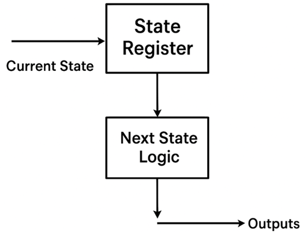

There are many applications where there is a need for our circuits to have "memory"; to remember previous inputs and calculate their outputs according to them. A circuit whose output depends not only on the present input but also on the history of the input is called a sequential circuit. In this section, we will learn how to design and build such sequential circuits using finite state machines (FSMs).

#### Understanding Sequential vs. Combinational Circuits

**Combinational Circuits**: Output depends only on current inputs
**Sequential Circuits**: Output depends on current inputs AND previous states (memory)

A finite state machine is a mathematical model used to design sequential circuits. As shown in Figure 1, an FSM consists of:

- **State Register**: Stores the current state using flip-flops
- **Next State Logic**: Combinational circuit that determines the next state
- **Output Logic**: Combinational circuit that generates outputs

### State Diagram Fundamentals

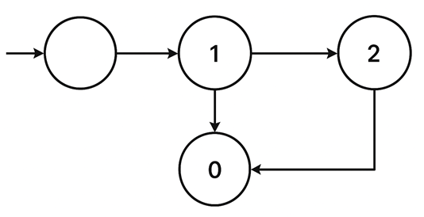

A state diagram is a graphical representation that describes the behavior of a finite state machine. As illustrated in Figure 2, every component of a state diagram has a specific meaning:

#### State Diagram Components

**States (Circles)**: Each circle represents a unique condition or state of the machine

- **Upper half**: Contains the state name or description
- **Lower half**: Contains the output value for that state

**Transitions (Arrows)**: Each arrow represents a possible change from one state to another

- **Arrow label**: Shows the input condition that causes the transition
- **Transition timing**: Occurs on each clock cycle based on current input

**Initial State**: Usually marked with an arrow pointing to it from nowhere, representing the starting condition

### Design Procedure for Sequential Circuits

Let's demonstrate the complete design procedure using a practical example: designing a digital circuit that produces a single HIGH pulse when a button is pressed, regardless of how long the button is held.

#### Step 1: Problem Definition

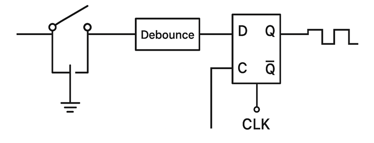

The first step is to clearly define what we want our circuit to do. In our example (Figure 3):

**Problem**: A manual button connected directly to a digital circuit will produce multiple HIGH signals due to the clock frequency being much faster than human reaction time.

**Solution**: Design a sequential circuit that outputs HIGH for exactly one clock cycle when the button transitions from LOW to HIGH, then remains LOW until the button is released and pressed again.

#### Step 2: State Diagram Design

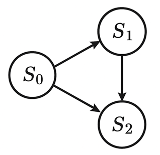

Next, we design the state diagram as shown in Figure 4. This diagram describes the operation of our sequential circuit:

**State S0 (IDLE)**:

- **Description**: Button not pressed, waiting for input
- **Output**: 0 (no pulse generated)
- **Transitions**:
  - Input 0 → Stay in S0
  - Input 1 → Go to S1

**State S1 (PULSE)**:

- **Description**: Button just pressed, generate pulse
- **Output**: 1 (HIGH pulse generated)
- **Transitions**:
  - Input 0 → Go to S2
  - Input 1 → Go to S2

**State S2 (WAIT)**:

- **Description**: Button held, wait for release
- **Output**: 0 (no additional pulse)
- **Transitions**:
  - Input 0 → Go to S0
  - Input 1 → Stay in S2

This state diagram ensures that exactly one pulse is generated per button press cycle.

#### Step 3: State Assignment

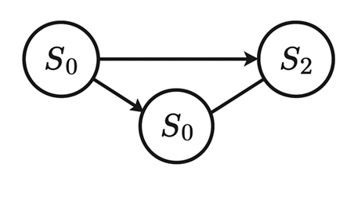

We replace the descriptive state names with binary numbers, as shown in Figure 5:

- **S0 (IDLE)** → **00**
- **S1 (PULSE)** → **01**
- **S2 (WAIT)** → **10**

The assignment starts from 0 for the initial state and continues sequentially. Since we have 3 states, we need 2 bits to represent them (2² = 4 possible combinations).

#### Step 4: State Table Construction

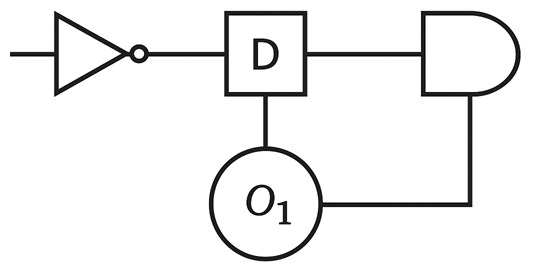

The state table (Figure 6) systematically describes the behavior of our finite state machine:

**Current State Columns**: Q₁Q₀ (present state bits)
**Input Column**: X (button input)
**Next State Columns**: Q₁⁺Q₀⁺ (next state bits)
**Output Column**: Y (circuit output)

Each row represents a specific combination of current state and input, showing the resulting next state and output. The state table completely describes the FSM behavior.

### Implementation with D Flip-Flops

#### Step 5a: D Flip-Flop Analysis

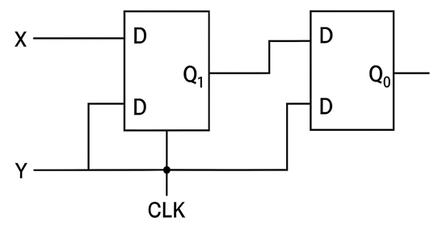

For D flip-flop implementation (Figure 7), we add columns for each flip-flop input. Since D flip-flops have the characteristic equation Q⁺ = D, the required input equals the next state:

**D₁ = Q₁⁺** (input for flip-flop 1)
**D₀ = Q₀⁺** (input for flip-flop 0)

This simplification makes D flip-flops popular for sequential circuit design.

#### Step 6a: Boolean Function Derivation

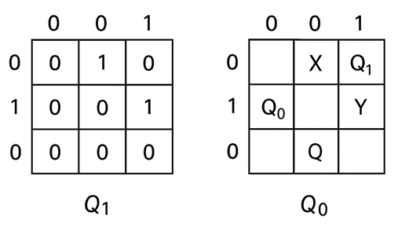

Using Karnaugh maps (Figure 8), we derive the Boolean functions for each D input and the output:

**D₁ = Q₀X'**
**D₀ = X**
**Y = Q₁'Q₀**

These functions define the combinational logic needed to drive the flip-flops and generate the output.

### Implementation with JK Flip-Flops

#### Step 5b: JK Flip-Flop Analysis

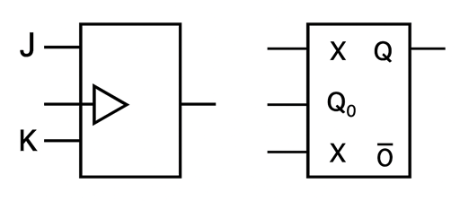

For JK flip-flop implementation (Figure 9), we need to determine both J and K inputs for each flip-flop. The JK flip-flop characteristic table helps us find the required inputs:

**JK Flip-Flop Excitation Table**:

- Q → Q⁺ = 0: J = 0, K = X (don't care)
- Q → Q⁺ = 1: J = 1, K = X (don't care)
- Q → Q⁺ = 0: J = X (don't care), K = 1
- Q → Q⁺ = 1: J = X (don't care), K = 0

#### Step 6b: JK Boolean Functions

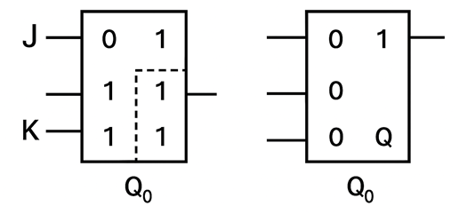

Using Karnaugh maps for JK inputs (Figure 10):

**J₁ = Q₀X'**, **K₁ = Q₀ + X**
**J₀ = X**, **K₀ = X'**
**Y = Q₁'Q₀**

### Circuit Implementation

#### Step 7: Final Circuit Design

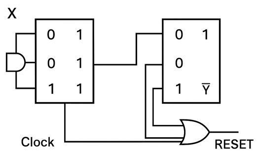

The final step involves constructing the actual circuit (Figure 11):

1. **Place flip-flops**: One for each state bit
2. **Implement next state logic**: Use logic gates to realize the Boolean functions
3. **Implement output logic**: Generate the output signal
4. **Connect clock and reset**: Provide synchronization and initialization

The combinational logic takes inputs from the flip-flop outputs (current state) and external inputs, generating the appropriate flip-flop inputs for the next state transition.

### Types of Finite State Machines

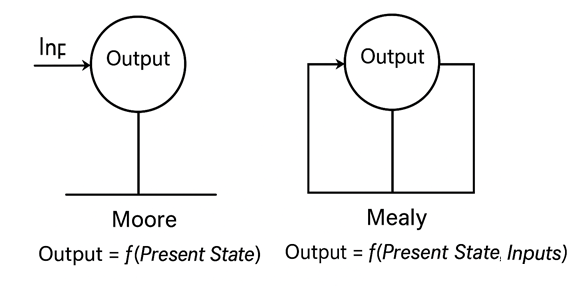

#### Moore State Machine

In a Moore machine (Figure 12a), the output depends only on the current state:

**Output = f(Present State)**

**Characteristics**:

- Outputs are stable and change only on state transitions
- Generally requires more states for complex problems
- Outputs are synchronized with the clock
- Less susceptible to input noise

#### Mealy State Machine

In a Mealy machine (Figure 12b), the output depends on both current state and current inputs:

**Output = f(Present State, Inputs)**

**Characteristics**:

- Outputs can change immediately when inputs change
- Generally requires fewer states than Moore machines
- Faster response to input changes
- May produce glitches if inputs change between clock edges

### Applications of Finite State Machines

FSMs are fundamental building blocks in digital systems:

#### Control Units

- **Processor control**: Instruction fetch, decode, execute cycles
- **Memory controllers**: DRAM refresh, cache management
- **Communication protocols**: Handshaking, error detection

#### Sequential Detectors

- **Pattern recognition**: Detecting specific bit sequences
- **Security systems**: Password verification, access control
- **Communication**: Frame synchronization, protocol parsing

#### Counters and Timers

- **Digital clocks**: Time keeping, alarm systems
- **Traffic controllers**: Light sequencing, timing control
- **Industrial automation**: Process control, machinery operation

The systematic design procedure we've covered provides a reliable method for implementing any sequential logic function using finite state machines, making them indispensable tools in digital system design.
