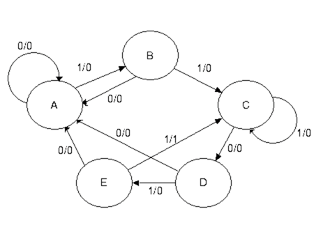
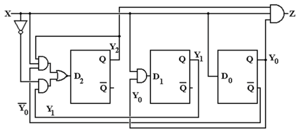
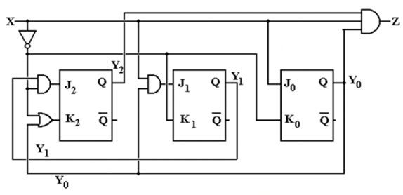
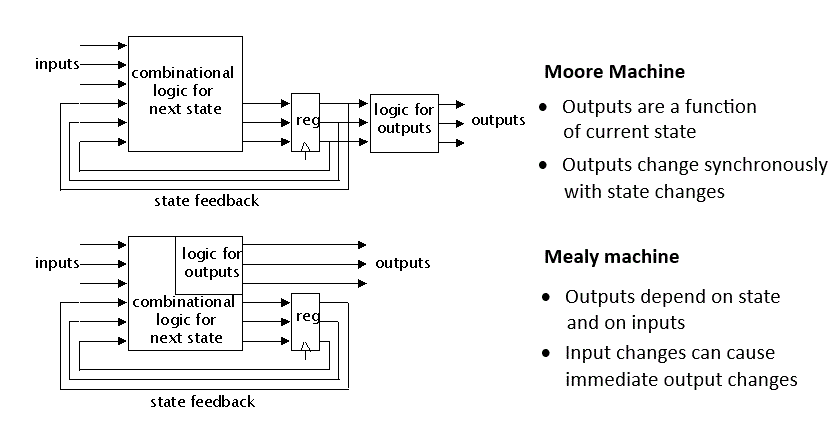

### Finite State Machines and Sequential Circuits

There are many applications where there is a need for our circuits to have "memory"; to remember previous inputs and calculate their outputs according to them. A circuit whose output depends not only on the present input but also on the history of the input is called a sequential circuit. In this section, we will learn how to design and build such sequential circuits using finite state machines (FSMs).

#### Understanding Sequential vs. Combinational Circuits

**Combinational Circuits**: Output depends only on current inputs
**Sequential Circuits**: Output depends on current inputs AND previous states (memory)

A finite state machine is a mathematical model used to design sequential circuits. As shown in Figure 1, an FSM consists of:

- **State Register**: Stores the current state using flip-flops
- **Next State Logic**: Combinational circuit that determines the next state
- **Output Logic**: Combinational circuit that generates outputs

### State Diagram Fundamentals

A state diagram is a graphical representation that describes the behavior of a finite state machine. As illustrated in Figure 2, every component of a state diagram has a specific meaning:

#### State Diagram Components

**States (Circles)**: Each circle represents a unique condition or state of the machine

- **Upper half**: Contains the state name or description
- **Lower half**: Contains the output value for that state

**Transitions (Arrows)**: Each arrow represents a possible change from one state to another

- **Arrow label**: Shows the input condition that causes the transition
- **Transition timing**: Occurs on each clock cycle based on current input

**Initial State**: Usually marked with an arrow pointing to it from nowhere, representing the starting condition

## Design of 11011 Sequence Detector Using JK Flip-Flops (With Overlap)

### Step 1 – Derive the State Diagram and State Table

#### Step 1a – Determine the Number of States

For a sequence detector detecting an N-bit sequence, at least N states are required.

We are designing a 5-bit sequence detector (11011), therefore the number of states required is 5.

Label the states as A, B, C, D, and E.  
A is the initial state.

---

#### Step 1b – Characterize Each State

| State | Has  | Awaiting |
| ----- | ---- | -------- |
| A     | —    | 11011    |
| B     | 1    | 1011     |
| C     | 11   | 011      |
| D     | 110  | 11       |
| E     | 1101 | 1        |

---

#### Step 1c – Transitions for Expected Sequence

Transitions are labeled as **X / Z**, where:

- X = Input
- Z = Output

For the expected input sequence:

- A → B on 1 / 0
- B → C on 1 / 0
- C → D on 0 / 0
- D → E on 1 / 0
- E → C on 1 / 1 (sequence detected, overlapping allowed)

#### Step 1d – Inputs That Break the Sequence

| State | On Input 0 | On Input 1 | Comment                           |
| ----- | ---------- | ---------- | --------------------------------- |
| A     | Stay in A  | Go to B    | Waiting on 1                      |
| B     | Go to A    | Go to C    | "10" not part of sequence         |
| C     | Go to D    | Stay in C  | Overlap due to “11”               |
| D     | Go to A    | Go to E    | "1100" restarts sequence          |
| E     | Go to A    | Go to C    | "11011" detected, overlap at "11" |

---

#### Step 1e – Generate State Table with Output

| Present State | Input X | Next State | Output Z |
| ------------- | ------- | ---------- | -------- |
| A             | 0       | A          | 0        |
| A             | 1       | B          | 0        |
| B             | 0       | A          | 0        |
| B             | 1       | C          | 0        |
| C             | 0       | D          | 0        |
| C             | 1       | C          | 0        |
| D             | 0       | A          | 0        |
| D             | 1       | E          | 0        |
| E             | 0       | A          | 0        |
| E             | 1       | C          | 1        |

---

### Step 2 – Determine Number of Flip-Flops

We have 5 states (N = 5).  
To determine the number of flip-flops:

2^(P-1) < 5 ≤ 2^P → P = 3

Therefore, three flip-flops are required.

---

### Step 3 – Assign State Codes

Optimized state assignments:

| State | Binary Code (Y₂ Y₁ Y₀) |
| ----- | ---------------------- |
| A     | 000                    |
| B     | 001                    |
| C     | 011                    |
| D     | 100                    |
| E     | 101                    |

---

### Step 4 – Transition Table with Output

| Y₂Y₁Y₀ (PS) | X   | Next State (Y₂'Y₁'Y₀') | Z   |
| ----------- | --- | ---------------------- | --- |
| 000 (A)     | 0   | 000                    | 0   |
| 000         | 1   | 001                    | 0   |
| 001 (B)     | 0   | 000                    | 0   |
| 001         | 1   | 011                    | 0   |
| 011 (C)     | 0   | 100                    | 0   |
| 011         | 1   | 011                    | 0   |
| 100 (D)     | 0   | 000                    | 0   |
| 100         | 1   | 101                    | 0   |
| 101 (E)     | 0   | 000                    | 0   |
| 101         | 1   | 011                    | 1   |

---

#### Step 4a – Output Equation

The output Z = 1 only when:  
Present State = 101 (Y₂=1, Y₁=0, Y₀=1) and Input X = 1

Therefore,  
**Z = X · Y₂ · Y₁' · Y₀**

---

### Step 5 – Separate Transition Tables (per Flip-Flop)

From D flip-flop behavior, the next-state equations are:

D₂ = X’·Y₁ + X·Y₂·Y₀’  
D₁ = X·Y₀  
D₀ = X

---

### Step 6 – Use JK Flip-Flops

The design specifies JK flip-flops, so D equations are converted into JK excitation forms.

---

### Step 7 – JK Excitation Table

| Q(T) | Q(T+1) | J   | K   |
| ---- | ------ | --- | --- |
| 0    | 0      | 0   | d   |
| 0    | 1      | 1   | d   |
| 1    | 0      | d   | 1   |
| 1    | 1      | d   | 0   |

---

### Step 8 – Derive Input Equations

#### Flip-Flop Y₂

- For X = 0 → J₂ = Y₁, K₂ = 1
- For X = 1 → J₂ = 0, K₂ = Y₀

Combined equations:  
J₂ = X’·Y₁  
K₂ = X’ + Y₀

---

#### Flip-Flop Y₁

- For X = 0 → J₁ = 0, K₁ = 1
- For X = 1 → J₁ = Y₀, K₁ = 0

Combined equations:  
J₁ = X·Y₀  
K₁ = X’

---

#### Flip-Flop Y₀

- For X = 0 → J₀ = 0, K₀ = 1
- For X = 1 → J₀ = 1, K₀ = 0

Combined equations:  
J₀ = X  
K₀ = X’

---

### Step 9 – Final Equations Summary

| Parameter | Equation        |
| --------- | --------------- |
| Z         | Z = X·Y₂·Y₁'·Y₀ |
| J₂        | J₂ = X'·Y₁      |
| K₂        | K₂ = X' + Y₀    |
| J₁        | J₁ = X·Y₀       |
| K₁        | K₁ = X'         |
| J₀        | J₀ = X          |
| K₀        | K₀ = X'         |

---

### Step 10 – Circuit Representation

The circuit shown above represents the Finite State Machine (FSM) implementation using three JK flip-flops, designed according to the state and output equations derived previously.
For practical implementation, logic gates corresponding to each equation are connected to drive the J and K inputs of the flip-flops, and the output Z is derived from the condition Z = X·Y₂·Y₁'·Y₀.

---

### Equivalent D Flip-Flop Implementation

If implemented using D flip-flops, the equivalent next-state equations are:

D₂ = X'·Y₁ + X·Y₂·Y₀'  
D₁ = X·Y₀  
D₀ = X

## Types of Finite State Machines

### Moore State Machine

In a Moore machine (Figure 12a), the output depends only on the current state:

**Output = f(Present State)**

**Characteristics**:

- Outputs are stable and change only on state transitions
- Generally requires more states for complex problems
- Outputs are synchronized with the clock
- Less susceptible to input noise

### Mealy State Machine

In a Mealy machine (Figure 12b), the output depends on both current state and current inputs:

**Output = f(Present State, Inputs)**

**Characteristics**:

- Outputs can change immediately when inputs change
- Generally requires fewer states than Moore machines
- Faster response to input changes
- May produce glitches if inputs change between clock edges

## Applications of Finite State Machines

FSMs are fundamental building blocks in digital systems:

#### Control Units

- **Processor control**: Instruction fetch, decode, execute cycles
- **Memory controllers**: DRAM refresh, cache management
- **Communication protocols**: Handshaking, error detection

#### Sequential Detectors

- **Pattern recognition**: Detecting specific bit sequences
- **Security systems**: Password verification, access control
- **Communication**: Frame synchronization, protocol parsing

#### Counters and Timers

- **Digital clocks**: Time keeping, alarm systems
- **Traffic controllers**: Light sequencing, timing control
- **Industrial automation**: Process control, machinery operation

The systematic design procedure we've covered provides a reliable method for implementing any sequential logic function using finite state machines, making them indispensable tools in digital system design.
